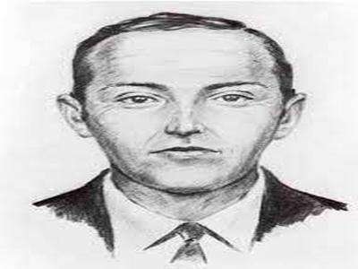
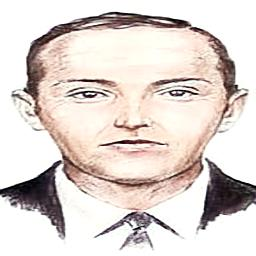
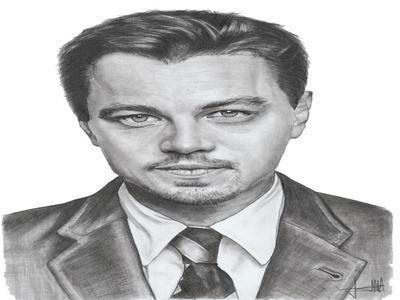
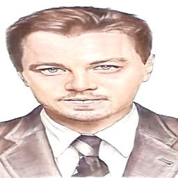

# Barebones DeSketchify

Before starting please download model [from here](https://drive.google.com/file/d/1c-X9D_wwYX7eitxHQsHwTWi-ZvN9FLID/view?usp=sharing) or from link in present in models folder

Get Dependencies 
```
conda env create -f environment.yml
```
and then run 
```
python app.py
```
## Sample

| Sketch             |  Coloured Sketch |
:-------------------------:|:-------------------------:
  |  
  |  
